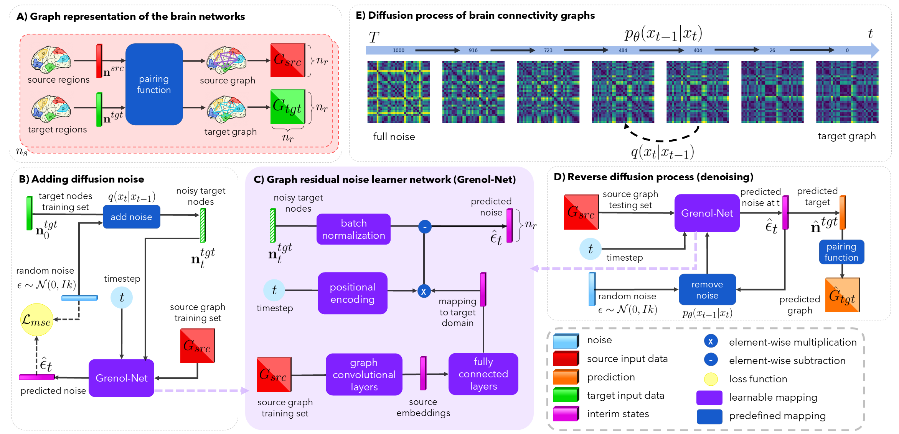
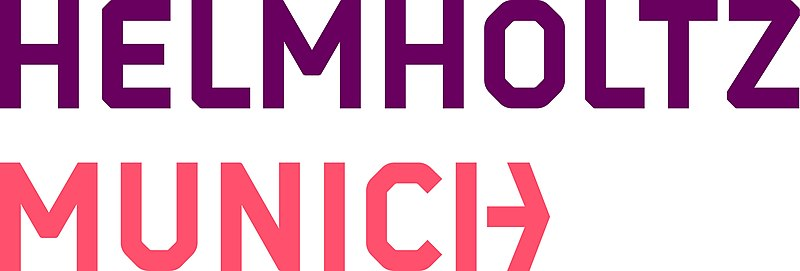

Graph Residual Noise Learner Network (Grenol-Net)
=================================================

Diffusion-based Grenol-Net for graph-to-graph prediction for brain connectivity graphs, coded up in Python by Oytun Demirbilek.
Please contact oytun1996@gmail.com for further inquiries. Thanks.

This repository provides the official PyTorch implementation of the following paper:

  A morphological brain graph depicting a connectional fingerprint is of paramount importance for charting brain dysconnectivity patterns.
  Such data often has missing observations due to various reasons such as time-consuming and incomplete neuroimage processing pipelines.
  Thus, predicting a target brain graph from a source graph is crucial for better diagnosing neurological disorders with minimal data
  acquisition resources. Many brain graph generative models were proposed for promising results, yet they are mostly based on generative
  adversarial networks (GAN), which could suffer from mode collapse and require large training datasets. Recent developments in diffusion
  models address these problems by offering essential properties such as a stable training objective and easy scalability. However, applying
  a diffusion process to graph edges fails to maintain the topological symmetry of the brain connectivity matrices. To meet these challenges,
  we propose the Graph Residual Noise Learner Network (Grenol-Net), the first graph diffusion model for predicting a target graph from a
  source graph. Its two core contributions lie in (i) introducing a graph diffusion model that learns node-level noise for accurate denoising
  (ii) introducing a node-based diffusion function to better maintain the topological structure of brain graphs. Our Grenol-Net is composed of
  graph convolutional blocks, which first learn the source embeddings and second, a set of fully connected layers assisted with a positional
  encoding block that predicts the nodes with noise level $t-1$ in the target domain. We further design a batch normalization block that learns
  the target distribution at diffusion timestep $t$ and operates an element-wise subtraction from the predicted nodes with noise level $t-1$.
  Our Grenol-Net outperformed existing methods on the morphological brain graph extracted from cortical measurements of the left and right
  hemispheres separately and on three distinct datasets from multiple cohorts.

This work is accepted for publication in 6th Workshop on GRaphs in biomedicAl Image anaLysis (GRAIL 2024), Marakesh, Morocco, a MICCAI satellite event. 
Grenol-Net is a geometric deep learning framework for predicting a target brain graph from the source. Using a generative learning fashion, it preserves the
topological structure of each target graph.

We have evaluated our method on 3 datasets:

- Child and Adolescent NeuroDevelopment Initiative Schizophrenia Bulletin 2008 (`Candishare <https://www.nitrc.org/projects/cs_schizbull08/>`_)
- Human Connectome Project Young Adult (`HCP <https://www.humanconnectome.org/study/hcp-young-adult/document/extensively-processed-fmri-data-documentation>`_)
- Openneuro Cannabis Use Disorders Identification Test (`ds000174 <https://github.com/OpenNeuroDatasets/ds000174>`_)

In this repository, we release the code for training, testing and inference of Grenol-Net on Openneuro dataset. Unfortunately, we are
unable to provide the processed connectomes for Candishare and HCP, since these datasets are held private.

We have evaluated our method on 3 benchmarks:

- Multi-graph Convolutional Generative Adversarial Network `(MGCN-GAN) <https://github.com/qidianzl/Recovering-Brain-Structure-Network-Using-Functional-Connectivity>`_
- Hierarchical Adversarial Domain Alignment `(HADA) <https://github.com/basiralab/HADA>`_
- Deep Graph Normalizer Network `(DGN) <https://github.com/basiralab/DGN>`_

Installation
------------

The code has been written in Python 3.10, torch==1.13.1 and torch-geometric==2.3.0 on Ubuntu 22.04 Windows Subsystem Linux (WSL).
GPU is not required to run the code but it is recommended, and pretrained model trained on CUDA compiler version 11.5. The model is tested on:

- python 3.8, 3.9, 3.10, 3.11, 3.12
- major pytorch versions: v1.11.0, v1.12.1, v1.13.1, v2.0.1, v2.1.2, v2.2.2, v2.3.1 and latest.
- latest version of operating systems: windows, ubuntu and macos

Please also keep in mind that using CPU on Windows operating system might lead to slightly different results for the first a couple of epochs.

You also need other dependencies listed in ``pyproject.toml``. All can be installed via::

  $ pip install .

Training and testing
--------------------

We provide an entrypoint for the experiments, which is parameterized in ``grenolnet/__main__.py``. Since there are many parameters regarding the experiments,
we decided to not provide argument parsing for some low-level parameters to maintain simplicity. You can change them if it's necessary in ``__main__.py`` and then run::

  $ python -m grenolnet --train

The above command will only train a model with default name and default parameters. To change the dataset to openneuro and right hemisphere, you can type::

  $ python -m grenolnet --train --dataset openneuro --hem right

You can give a name to your model to differ it from other models, use something specific like::

  $ python -m grenolnet --train --dataset openneuro --hem right --model-name op_right_retrain

To specify your preferred device::

  $ python -m grenolnet --train --device cuda

We provide many pretrained models to enable them for a later use, you can use a trained model with::

  $ python -m grenolnet --infer --load-model --model-name op_right_retrain --dataset openneuro --hem right

You can test the same model on different datasets also, for example testing a model trained on openneuro using the hcp dataset::

  $ python -m grenolnet --infer --load-model --model-name op_right_retrain --dataset hcp --hem right

Note that this also makes it easier to adapt your own dataset to make it usable with our model. For further information, please also check
our brain graph processing package: `(avicortex) <https://github.com/oytundemirbilek/avicortex>`_

We provide a benchmarking module in ``grenolnet/benchmarking.py``, which collects all predictions and targets from the ``benchmarks`` folder and calculates
all the metrics subject-wise. Then these subject-wise results can be plotted by running ``grenolnet/plotting.py`` file to create the boxplots.

We provide several jupyter notebooks to create a playground, especially for the diffusion. To illustrate how the changes in parameters effect the noisy
graphs. With the selected parameters, note that graphs still should include some of their original patterns. You can also test the same parameters on regular images.

Input data
----------

In order to use our framework, you need to have:

- Freesurfer output per subject and stats files.
- A table consisting all stats per subject. Example tables has given for Openneuro dataset.
- A torch Dataset class to convert the Freesurfer table to torch-geometric graph objects.
- You can use our Python package `avicortex <https://pypi.org/project/avicortex/>`_, if you have access to HCP and Candishare datasets.

Output data
-----------

Grenol-Net output is a torch-geometric graph object as prediction. This object usually consists of:

- subject id
- node features (n_nodes, n_features) which in our case is (34, 1)
- edge features (n_nodes x n_nodes, n_features) which in our case is (1156, 1)
- adjacency matrix (n_nodes, n_nodes, n_features) which in our case is (34, 34, 1)

+------------+------------------+
| |itu-logo| | |helmholtz-logo| |
+------------+------------------+

Citation
--------

  @inproceedings{demirbilek2024grenol,
    title={Graph Residual Noise Learner Network for Brain Connectivity Graph Prediction},
    author={Demirbilek, Oytun and Peng, Tingying and Bessadok, Alaa},
    booktitle={6th Workshop on GRaphs in biomedicAl Image anaLysis},
    year={2024},
    organization={Springer},

  }
